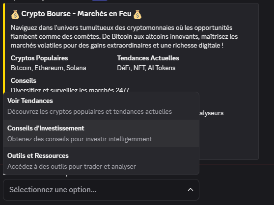
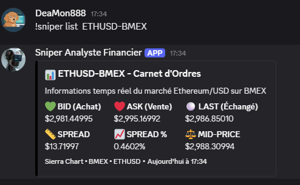

<p align="center">
  
</p>

<br>

<p align="center">
  <a href="https://www.typescriptlang.org/"></a>
  <a href="https://nodejs.org/"></a>
  <a href="https://discord.js.org/"></a>
  <a href="https://zod.dev/"></a>
  <a href="#"></a>
</p>

---

## 📖 À propos

**Imaginez pouvoir contrôler Discord avec votre IA préférée** ! 💬

Discord MCP Server est un **pont** entre votre intelligence artificielle et Discord. Il transforme votre bot Discord en un assistant intelligent capable de comprendre et d'exécuter vos commandes.

### 🤖 Comment ça marche ?

1. **Votre IA** envoie une commande
2. **Discord MCP Server** traduit cette commande pour Discord
3. **Votre bot** exécute l'action sur votre serveur

### 🌟 Compatible avec TOUS les assistants IA :

- ✅ **Claude Code** (l'outil que vous utilisez maintenant !)
- ✅ **Google AI Studio** (Gemini)
- ✅ **Antigravity**
- ✅ **Gemini CLI**
- ✅ **Cursor AI**
- ✅ **Kilo Code**
- ✅ **Cline**
- ✅ Et tous les autres assistants supportant MCP !

**En résumé :** Parlez à votre IA, et votre bot Discord exécute. C'est aussi simple que ça ! 🚀

Avec **26 outils puissants**, vous pouvez faire absolument tout sur Discord :

- Envoyer des messages
- Créer des sondages interactifs, menu et boutons
- Gérer votre serveur
- Et bien plus encore !

---

## 🛠️ Fonctionnalités

<details>
<summary>💬 Gestion des Messages (7 outils)</summary>

| Outil               | Description                           |
| ------------------- | ------------------------------------- |
| **discord_status**  | Vérifie le statut de connexion du bot |
| **envoyer_message** | Envoie un message texte simple        |
| **read_messages**   | Lit l'historique des messages         |
| **edit_message**    | Modifie un message existant           |
| **delete_message**  | Supprime un message                   |
| **add_reaction**    | Ajoute une réaction emoji             |
| **creer_sondage**   | Crée un sondage interactif            |

</details>

<details>
<summary>📎 Fichiers et Médias (1 outil)</summary>

| Outil                | Description                          |
| -------------------- | ------------------------------------ |
| **uploader_fichier** | Upload un fichier local vers Discord |

</details>

<details>
<summary>🎨 Embeds (3 outils)</summary>

| Outil                    | Description                                |
| ------------------------ | ------------------------------------------ |
| **creer_embed**          | Crée un embed enrichi personnalisable      |
| **lister_templates**     | Liste tous les templates disponibles       |

</details>

<details>
<summary>💻 Code (1 outil)</summary>

| Outil            | Description                                |
| ---------------- | ------------------------------------------ |
| **code_preview** | Affiche du code avec coloration syntaxique |

</details>

<details>
<summary>🔗 Webhooks (3 outils)</summary>

| Outil              | Description                   |
| ------------------ | ----------------------------- |
| **create_webhook** | Crée un webhook sur un canal  |
| **list_webhooks**  | Liste les webhooks d'un canal |
| **send_webhook**   | Envoie un message via webhook |

</details>

<details>
<summary>🏢 Serveur et Membres (5 outils)</summary>

| Outil               | Description                        |
| ------------------- | ---------------------------------- |
| **get_server_info** | Informations détaillées du serveur |
| **get_channels**    | Liste tous les canaux              |
| **list_members**    | Liste les membres et leurs rôles   |
| **get_user_info**   | Informations sur un utilisateur    |
| **statut_bot**      | Statut actuel du bot               |

</details>

<details>
<summary>🎮 Interactions (6 outils)</summary>

| Outil                     | Description                    |
| ------------------------- | ------------------------------ |
| **create_custom_buttons** | Crée des boutons personnalisés |
| **create_custom_menu**    | Crée un menu déroulant         |
| **creer_sondage**         | Crée un sondage interactif     |
| **vote_sondage**          | Vote dans un sondage           |
| **appuyer_bouton**        | Appuie sur un bouton           |
| **selectionner_menu**     | Sélectionne dans un menu       |

</details>

---

## 🚀 Démarrage Rapide

### Prérequis

- [Node.js](https://nodejs.org/) (v16 ou plus)
- [npm](https://www.npmjs.com/) (v8 ou plus)
- Un bot Discord ([créer ici](https://discord.com/developers/applications))

### Installation

```bash
# Cloner le projet
git clone <url-repo>
cd serveur_discord

# Installer les dépendances
npm install

# Configurer le bot
cp .env.example .env
# Éditer .env avec votre token Discord

# Compiler le projet TypeScript
npm run build

# Démarrer le serveur
npm start
```

---

## ⚙️ Configuration

### Variables d'environnement

Créez un fichier `.env` :

```env
# Token Discord du bot (obligatoire)
DISCORD_TOKEN=votre_token_ici
```

### Configuration .mcp.json

Ajoutez à votre configuration MCP :

**Windows :**

```json
{
  "mcpServers": {
    "discord-server": {
      "command": "node",
      "args": ["CHEMIN_VERS_VOTRE_PROJET\\serveur_discord\\dist\\index.js"]
    }
  }
}
```

**Linux / macOS :**

```json
{
  "mcpServers": {
    "discord-server": {
      "command": "node",
      "args": ["CHEMIN_VERS_VOTRE_PROJET/serveur_discord/dist/index.js"]
    }
  }
}
```

> ⚠️ **Important**: Remplacez `CHEMIN_VERS_VOTRE_PROJET` par le chemin absolu vers votre installation

---

## 🤖 Configuration du Bot Discord

1. **Créez un bot** sur le [Portail Développeur](https://discord.com/developers/applications)

2. **Activez les intents** :
   - ✅ Server Members Intent
   - ✅ Message Content Intent

3. **Invitez le bot** avec les permissions :
   - Gérer les messages
   - Envoyer des messages
   - Intégrer des liens
   - Ajouter des réactions
   - Utiliser les emojis externes

---

## 💡 Cas d'usage

Avec Discord MCP Server, vous pouvez :

- 💬 **Automatiser les messages** de bienvenue
- 📊 **Créer des sondages** interactifs
- 🎨 **Générer des embeds** magnifiques
- 📋 **Modérer** votre serveur
- 🔔 **Configurer des webhooks** pour les notifications
- 🎮 **Créer des boutons** pour les commandes rapides
- 📈 **Surveiller** l'activité du serveur
- 🤖 **Créer un bot IA qui répond à TOUT** - Le bot ultime qui peut :
  - Répondre aux questions des membres
  - Aider à la modération automatiquement
  - Animer le serveur avec des jeux et quiz
  - Donner des informations en temps réel
  - Apprendre et s'adapter à votre communauté
  - Interagir avec tous les services externes (API, bases de données, etc.)

---

## 🤖 Prompt System Optimisé

Pour exploiter pleinement les 26 outils de Discord MCP Server, utilisez le **prompt système dédié** :

👉 **[Accéder au prompt ou skill système ici](https://hackmd.io/@1-f9TrSqR0iVfHGkGYO3zw/rk8_YHVQZl)**

### Qu'est-ce que c'est ?

Un prompt système spécialement conçu pour permettre à votre IA de :

- 🎯 **Utiliser automatiquement** les bons outils Discord selon vos demandes
- 🔧 **Comprendre** les interactions complexes (boutons, menus, sondages)
- 📋 **Générer** des réponses adaptées à chaque contexte Discord
- 🚀 **Optimiser** l'utilisation des 26 outils disponibles

### Comment l'utiliser ?

1. **Copiez** le prompt système depuis le lien ci-dessus
2. **Collez-le** dans votre système de prompt (Claude, ChatGPT, etc.)
3. **Discutez** normalement - l'IA choisira automatiquement les bons outils Discord

Exemple : _"Envoie un message de bienvenue avec des boutons interactifs dans le channel #général"_

L'IA utilisera automatiquement les outils :

- `get_channels` pour trouver le channel
- `envoyer_message` pour le message
- `create_custom_buttons` pour les boutons

---

## 📚 Documentation

- [🎮 Serveur Discord](https://discord.gg/4AR82phtBz)
- [📘 Documentation Discord.js](https://discord.js.org/)
- [🔌 Model Context Protocol](https://modelcontextprotocol.io/)
- [📚 Guide Discord Developers](https://discord.com/developers/docs/intro)
- [🤖 Prompt System/Skill pour Discord MCP](https://hackmd.io/@1-f9TrSqR0iVfHGkGYO3zw/rk8_YHVQZl) - _Prompt système optimisé pour exploiter tous les outils Discord MCP_

---

## 🤝 Contribuer

Les contributions sont les bienvenues ! N'hésitez pas à :

- ⭐ Mettre une étoile au projet
- 🐛 Signaler des issues
- 💡 Proposer des améliorations
- 🔧 Envoyer des pull requests

---

<div align="center">

**Made with ❤️ by DeaMoN888**

[](https://github.com/yourusername/discord-mcp-server)
[](https://github.com/yourusername/discord-mcp-server)
[](https://github.com/yourusername/discord-mcp-server)

</div>

---

## 📸 Galerie

Voici quelques exemples d'utilisation de Discord MCP Server :

### 🔐 Crypto



### 🎭 Feux de rôle


### 💻 Aperçu du code


### 🍌 Nano Banana


### 📈 Ethereum Price


